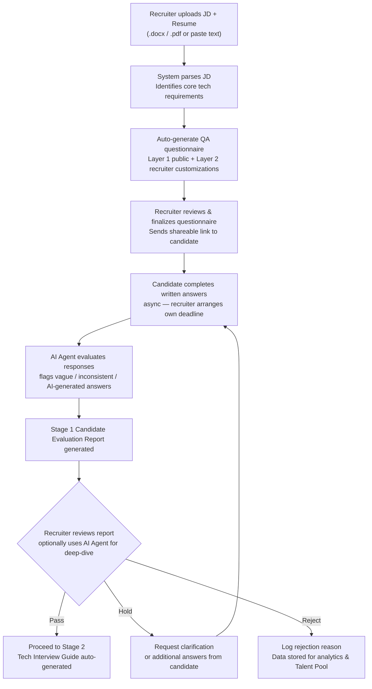

# 03 — 第一階段：初步篩選（Stage 1）

## 整體流程

**作答時程**：無系統強制截止，由 Recruiter 自行與候選人協調安排。

---

## 輸入方式

| 輸入類型 | 支援格式 | 說明 |
|---|---|---|
| JD 上傳 | `.docx`、`.pdf` | 系統自動解析職缺需求 |
| 候選人履歷上傳 | `.docx`、`.pdf` | 用於個人化問題生成與交叉比對 |
| 手動文字輸入 | 純文字 | 若無檔案，直接貼上文字 |

> 上傳的檔案存於 **Azure Blob Storage**，解析工作由後端 `JdParserPlugin` 完成。

### 履歷個人化

上傳候選人履歷後，系統可對照 JD 生成**針對該候選人背景**的問題，而非通用問卷，更能有效識別「是否真的做過」。

---

## 問卷範本：公版問題範例（Full Stack / Azure 職缺）

> 問卷語言為**全英文**（目前專注印度市場，Recruiter 與候選人均為印度籍）。

**Instructions（固定顯示於問卷頂部）**

---

> Please answer the following questions based on your **actual project experience**.
>
> For each answer, briefly include:
> - Project context
> - Technologies used
> - Your specific responsibilities
>
> Short answers are acceptable. Focus on what **you personally did**, not general best practices.
>
> *Note: This questionnaire uses AI-assisted evaluation. Generic or AI-generated answers will be identified and may affect your score.*
>
> ☐ I understand and consent to AI-assisted evaluation of my responses.

---

**Q1. Azure Resource Experience**

Describe the Azure resources you have used in a real project.
Please include:
- The Azure services used (e.g. App Service, Azure Functions, Key Vault, Service Bus, etc.)
- What the system was used for
- Your role in configuring or managing these resources

---

**Q2. API Troubleshooting or Performance Issue**

Describe a situation where an API had a production issue or performance problem.
Briefly explain:
- How the issue was discovered
- The root cause
- What changes you made to resolve the problem

---

**Q3. Authentication and Secret Management**

In one of your projects, how were authentication and application secrets managed?
Briefly explain:
- How authentication works (e.g. JWT or another method)
- How sensitive information such as API keys or connection strings is stored and protected

---

> Public template questions are automatically selected and adapted based on JD keyword analysis.
> Recruiter can add, modify, or remove questions (Layer 2 customization).

---

## AI Agent：Recruiter 深入評估工具

Recruiter 可在查看候選人報告時開啟對話式 AI Agent：

- Ask the Agent anything about the candidate's answers — it surfaces direct quotes and context
- Agent generates **follow-up probe questions** based on red flags
- Agent consolidates findings and annotates the evaluation report
- All Agent conversations are saved and attached to the candidate record

---

## Stage 1 Candidate Evaluation Report

每位候選人完成問卷後自動生成：

| 項目 | 內容 |
|---|---|
| **Overall Recommendation** | Pass / Hold / Reject，附信心分數（0–100） |
| **Technical Fit Summary** | 依 JD 要求逐項對照：Confirmed / Partial / Missing |
| **Red Flags** | 模糊、前後矛盾或疑似 AI 生成的回答 |
| **Suggested Follow-up Questions** | 供 Recruiter 進一步釐清的 3–5 道追問 |
| **Resume vs. Answer Consistency** | 履歷聲明與問卷回答的自動交叉比對摘要 |

報告可匯出為 **PDF**。

---

## 評分 Rubric（詳細說明見 [02-core-design.md](02-core-design.md)）

| 評分等級 | 說明 |
|---|---|
| **Strong** | 具體、有細節、與 JD 高度相關 |
| **Acceptable** | 基本符合，細節略少但無紅旗 |
| **Needs Probe** | 回答模糊或範圍與 JD 相關性低，需追問 |
| **Insufficient** | 明顯通用答案、無具體細節或疑似 AI 生成 |
