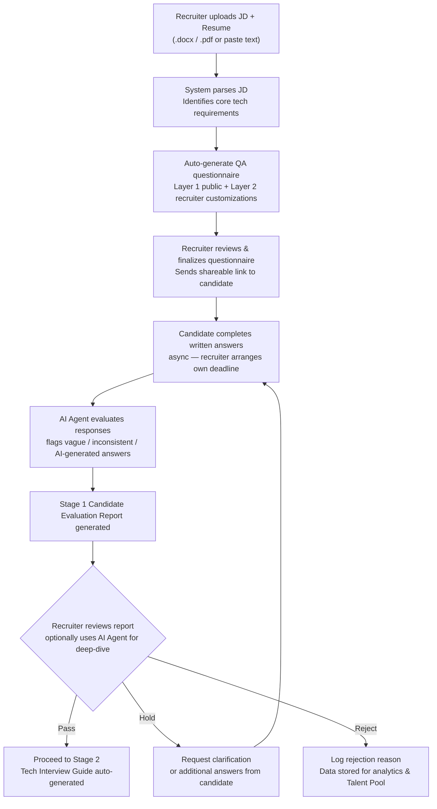

# 03 — Stage 1: Initial Screening

## Overall Flow

**Answer timeline**: No system-enforced deadline; Recruiter self-coordinates with candidates.

---

## Input Methods

| Input Type | Supported Formats | Description |
|---|---|---|
| JD Upload | `.docx`, `.pdf` | System auto-parses job requirements |
| Candidate Resume Upload | `.docx`, `.pdf` | Used for personalized question generation and cross-validation |
| Manual Text Input | Plain text | Paste text directly if no file available |

> Uploaded files are stored in **Azure Blob Storage**; parsing is done by the backend `JdParserPlugin`.

### Resume Personalization

After uploading a candidate resume, the system can generate questions **tailored to that candidate's background** against the JD, rather than a generic questionnaire, more effectively identifying whether they "actually did it".

---

## Questionnaire Template: Public Questions (Full Stack / Azure Roles)

> Questionnaire language is **all English** (currently focused on the India market; both Recruiters and candidates are India-based).

**Instructions (displayed at top of questionnaire)**

---

> Please answer the following questions based on your **actual project experience**.
>
> For each answer, briefly include:
> - Project context
> - Technologies used
> - Your specific responsibilities
>
> Short answers are acceptable. Focus on what **you personally did**, not general best practices.
>
> *Note: This questionnaire uses AI-assisted evaluation. Generic or AI-generated answers will be identified and may affect your score.*
>
> ☐ I understand and consent to AI-assisted evaluation of my responses.

---

**Q1. Azure Resource Experience**

Describe the Azure resources you have used in a real project.
Please include:
- The Azure services used (e.g. App Service, Azure Functions, Key Vault, Service Bus, etc.)
- What the system was used for
- Your role in configuring or managing these resources

---

**Q2. API Troubleshooting or Performance Issue**

Describe a situation where an API had a production issue or performance problem.
Briefly explain:
- How the issue was discovered
- The root cause
- What changes you made to resolve the problem

---

**Q3. Authentication and Secret Management**

In one of your projects, how were authentication and application secrets managed?
Briefly explain:
- How authentication works (e.g. JWT or another method)
- How sensitive information such as API keys or connection strings is stored and protected

---

> Public template questions are automatically selected and adapted based on JD keyword analysis.
> Recruiter can add, modify, or remove questions (Layer 2 customization).

---

## AI Agent: Recruiter Deep-Dive Tool

Recruiter can open a conversational AI Agent when reviewing candidate reports:

- Ask the Agent anything about the candidate's answers — it surfaces direct quotes and context
- Agent generates **follow-up probe questions** based on red flags
- Agent consolidates findings and annotates the evaluation report
- All Agent conversations are saved and attached to the candidate record

---

## Stage 1 Candidate Evaluation Report

Auto-generated for each candidate after submitting questionnaire:

| Item | Content |
|---|---|
| **Overall Recommendation** | Pass / Hold / Reject, with confidence score (0–100) |
| **Technical Fit Summary** | Item-by-item comparison against JD requirements: Confirmed / Partial / Missing |
| **Red Flags** | Vague, contradictory, or suspected AI-generated answers |
| **Suggested Follow-up Questions** | 3–5 probe questions for Recruiter to clarify further |
| **Resume vs. Answer Consistency** | Automated cross-reference summary of resume claims vs. questionnaire answers |

Report can be exported as **PDF**.

---

## Scoring Rubric (see [02-core-design.md](02-core-design.md) for details)

| Score Level | Description |
|---|---|
| **Strong** | Specific, detailed, highly relevant to JD |
| **Acceptable** | Basically meets requirements, slightly less detail but no red flags |
| **Needs Probe** | Vague answer or low relevance to JD scope, requires follow-up |
| **Insufficient** | Clearly generic answer, no specific details, or suspected AI-generated |
