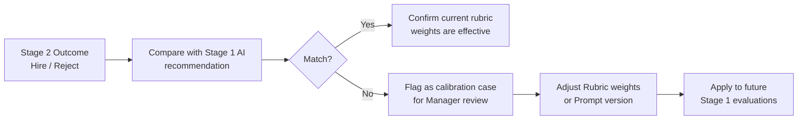

# 04 — 第二階段：技術面試（Stage 2）

## 說明

第二階段由**台灣技術面試官**負責，形式為線上面試（視訊）。系統不取代面試，而是提供結構化的引導報告，協助面試官聚焦高價值問題。

**面試錄影**：技術面試進行錄影，面試完成後將逐字稿上傳至系統，AI 將連同面試引導報告一併整合分析，生成更完整的 Stage 2 Evaluation Report。

---

## 面試錄影與逐字稿處理

技術面試進行錄影。面試結束後，面試官在系統中上傳：

- 錄影逐字稿檔案（.txt / .vtt 等格式），由 AI 起始山書服務（例如 Azure AI Speech）生成，或由面試官手動整理
- 若無逐字稿，面試官可直接填寫結構化回饋表單

逐字稿由 `ReportGeneratorPlugin` 整合 Stage 1 評估、面試引導報告與逐字稿內容，自動生成 Stage 2 Evaluation Report。

> 錄影檔案本身不需上傳至本系統，逐字稿屬候選人檔案的一部分，儲存於 Azure Blob Storage 並設定獨立的存取權限。

---

## Technical Interview Guide

Stage 1 通過後，系統自動生成給台灣面試官的引導報告：

| 項目 | 內容 |
|---|---|
| **Candidate Summary** | 候選人背景摘要，來自履歷與 Stage 1 回答 |
| **Confirmed Strengths** | Stage 1 中驗證的技術優勢領域 |
| **Areas to Probe** | Stage 1 中回答模糊或邊界的技術面向，需深入確認 |
| **Suggested Interview Questions** | 依 Red Flags 自動生成的 3–5 道追問題目 |
| **JD Coverage Map** | 逐條 JD 要求：Confirmed / Needs Verification / Not Addressed |
| **Stage 1 AI Confidence Score** | AI 判斷回答為真實經驗的信心分數（0–100） |

報告可匯出為 **PDF**，於面試前寄送給面試官。

---

## 面試後評估報告（Stage 2 Evaluation Report）

技術面試結束後，面試官在系統中填寫結構化回饋表單，系統整合以下資料生成 **Stage 2 Report**：

- 面試引導報告
- 面試逐字稿（若已上傳）
- 面試官填寫的結構化評估

| 項目 | 內容 |
|---|---|
| **Live Technical Assessment** | 面試中確認的技術深度與廣度 |
| **Stage 1 vs Stage 2 Calibration** | AI Stage 1 評估與實際面試結果比較（用於持續改善 AI 準確率） |
| **Cultural / Working Style Fit** | 面試官對候選人溝通能力、態度的主觀評估 |
| **Final Recommendation** | Hire / Pass to Client / Reject，附理由說明 |
| **Client-Facing Summary** | AI 依報告草稿生成的英文候選人摘要，供 Recruiter 向客戶呈現 |

---

## AI 準確率校準迴路

Stage 2 結果自動回饋至系統，用於持續改善 Stage 1 AI 的評估品質：

> 此迴路讓 AI 評估準確率隨時間持續提升。

---

## 客戶 Feedback 連結

候選人通過 Stage 2 並推薦給客戶後，由**負責該客戶的人員**（Recruiter 或 Account Manager）從客戶處收集回饋並登錄系統：

- **Hired**：記錄客戶對候選人的正向評價，標記哪些 JD 要求確實是關鍵指標
- **Rejected at Client**：記錄拒絕原因（結構化標籤 + 自由文字），回饋至 Stage 1 評估標準調整

詳見 [05-manager-dashboard.md — 客戶 Feedback 管理](05-manager-dashboard.md)
