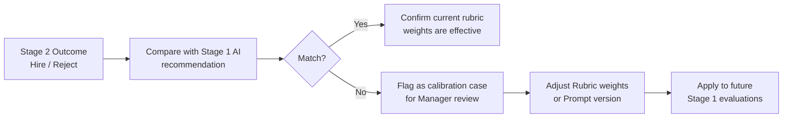

# 04 — Stage 2: Technical Interview

## Overview

Stage 2 is conducted by **Taiwan technical interviewers** in an online (video) format. The system does not replace the interview; it provides a structured guidance report to help interviewers focus on high-value questions.

**Interview recording**: The technical interview is recorded. After the interview, the transcript is uploaded to the system, where AI integrates it with the interview guidance report and generates a more complete Stage 2 Evaluation Report.

---

## Interview Recording & Transcript Processing

The technical interview is recorded. After the interview, the interviewer uploads to the system:

- Interview transcript file (.txt / .vtt or similar format), generated by an AI speech service (e.g. Azure AI Speech) or manually organized by the interviewer
- If no transcript is available, the interviewer can directly fill in a structured feedback form

The transcript is integrated by `ReportGeneratorPlugin` with the Stage 1 evaluation, interview guidance report, and transcript content to automatically generate the Stage 2 Evaluation Report.

> The recording file itself does not need to be uploaded to this system. Transcripts are part of the candidate file, stored in Azure Blob Storage with separate access permissions.

---

## Technical Interview Guide

After passing Stage 1, the system automatically generates a guidance report for the Taiwan interviewer:

| Item | Content |
|---|---|
| **Candidate Summary** | Candidate background summary from resume and Stage 1 answers |
| **Confirmed Strengths** | Technical strength areas validated in Stage 1 |
| **Areas to Probe** | Technical areas with vague or borderline answers in Stage 1 that need deeper investigation |
| **Suggested Interview Questions** | 3–5 follow-up questions auto-generated based on red flags |
| **JD Coverage Map** | Item-by-item JD requirements: Confirmed / Needs Verification / Not Addressed |
| **Stage 1 AI Confidence Score** | AI confidence score (0–100) for assessing whether answers reflect genuine experience |

Report can be exported as **PDF** and sent to the interviewer before the interview.

---

## Post-Interview Evaluation Report (Stage 2 Evaluation Report)

After the technical interview, the interviewer fills in a structured feedback form in the system. The system integrates the following data to generate the **Stage 2 Report**:

- Interview guidance report
- Interview transcript (if uploaded)
- Structured evaluation filled in by the interviewer

| Item | Content |
|---|---|
| **Live Technical Assessment** | Technical depth and breadth confirmed during the interview |
| **Stage 1 vs Stage 2 Calibration** | Comparison of AI Stage 1 evaluation with actual interview results (used for continuously improving AI accuracy) |
| **Cultural / Working Style Fit** | Interviewer's subjective assessment of candidate communication skills and attitude |
| **Final Recommendation** | Hire / Pass to Client / Reject, with justification |
| **Client-Facing Summary** | English candidate summary generated by AI from the report draft, for Recruiter to present to clients |

---

## AI Accuracy Calibration Loop

Stage 2 results are automatically fed back to the system to continuously improve Stage 1 AI evaluation quality:

> This loop allows AI evaluation accuracy to continuously improve over time.

---

## Client Feedback Integration

After a candidate passes Stage 2 and is recommended to the client, the **person responsible for that client** (Recruiter or Account Manager) collects feedback from the client and logs it in the system:

- **Hired**: Record positive client evaluation of the candidate, mark which JD requirements were indeed key indicators
- **Rejected at Client**: Record rejection reason (structured tags + free text), fed back to adjust Stage 1 evaluation criteria

See [05-manager-dashboard.md — Client Feedback Management](05-manager-dashboard.md)
