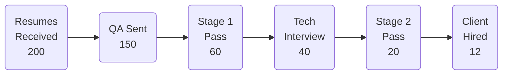
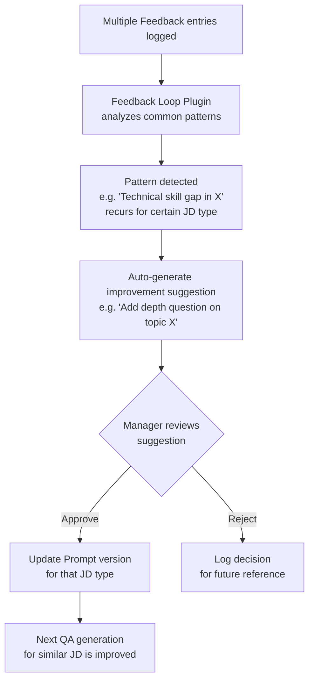

# 05 — Manager Dashboard

## Recruitment Funnel Analytics

### Recruitment Funnel Visualization

> Numbers above are examples; actual figures are calculated in real-time by the system.

### Key Metrics

| Metric | Description |
|---|---|
| Stage 1 Pass Rate | Ratio of questionnaires sent → Stage 1 passed |
| Stage 1 → Hire Conversion | Ratio of Stage 1 pass → final client hire (measures screening quality) |
| Stage 2 Pass Rate | Technical interview pass rate |
| AI vs. Human Agreement Rate | Consistency between AI recommendations and final Recruiter / Interviewer decisions |
| Time-to-Stage | Average processing days per stage |
| Rejection Reason Distribution | Categorized distribution of rejection reasons (Stage 1 / Stage 2 / Client) |

Sliceable by: **By Recruiter** / **By JD Type** / **By Time Period**

---

## Client Feedback Management

Client feedback is **manually logged by the person responsible for that client** (not necessarily the Recruiter — could also be the Account Manager or business person responsible for the client).

### Feedback Input Form

| Field | Type | Description |
|---|---|---|
| Outcome | Dropdown | Hired / Rejected at Client / Offer Declined |
| Rejection Category | Multi-select tags | Technical skill gap / Communication / Salary expectation / Culture fit / Over-qualified / Other |
| Client Comments | Free text | Direct client quotes or summary paraphrased by the responsible person |
| Submitted By | Auto-populated | Person logging this feedback (Recruiter or Account Manager) |
| Linked Candidate | Auto-linked | Corresponding candidate record |
| Linked JD | Auto-linked | Corresponding job opening |

### Feedback → QA Improvement Loop

---

## System Parameter Management

Manager can adjust the following parameters in the backend **without modifying code**:

| Parameter Category | Adjustable Items |
|---|---|
| **QA Generation** | Maximum questions per questionnaire, follow-up depth (0–3 levels), question type ratio (situational / technical / behavioral) |
| **Scoring Rubric Weights** | Technical Depth / Specificity / Relevance dimension weights |
| **AI Confidence Threshold** | Scores below this threshold are automatically flagged for "manual review" |
| **Prompt Version Management** | Switch Prompt versions for each Plugin, supporting A/B testing comparison |
| **Notification Settings** | Notification recipients and channels on stage completion (Email / system notification) |
| **Feedback Tag Library** | Add / modify client feedback category tags |
| **Recruiter Account Management** | Add Recruiter / Account Manager accounts, configure access permissions and workspaces |

---

## Exportable Reports

| Report Name | Description |
|---|---|
| Monthly Recruitment Summary | Overall monthly recruitment data (funnel, pass rates, timelines) |
| Recruiter Performance Report | Comparison of screening efficiency and accuracy across Recruiters |
| AI Accuracy Report | Monthly trend of AI evaluation accuracy, with calibration case analysis |
| Client Feedback Summary | Consolidated client feedback, categorized by JD type and rejection reason |
| Business Value Report | Time cost savings, efficiency improvement metrics (see [08-business-value.md](08-business-value.md)) |
