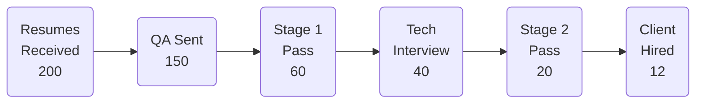
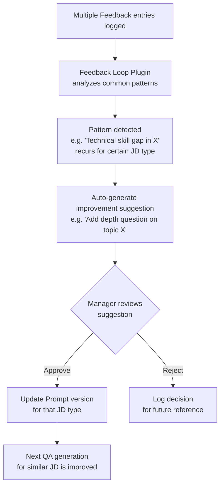

# 05 — 管理者後台（Manager Dashboard）

## 招募管道分析

### 招募漏斗視覺化

> 以上為範例數字；實際數值由系統即時統計。

### 關鍵指標

| Metric | 說明 |
|---|---|
| Stage 1 Pass Rate | 送出問卷 → Stage 1 通過的比率 |
| Stage 1 → Hire Conversion | Stage 1 通過 → 最終客戶錄用的比率（衡量篩選品質） |
| Stage 2 Pass Rate | 技術面試通過率 |
| AI vs. Human Agreement Rate | AI 推薦結果與 Recruiter / 面試官最終決定的一致率 |
| Time-to-Stage | 各階段平均處理天數 |
| Rejection Reason Distribution | 拒絕原因分類分佈（Stage 1 / Stage 2 / Client) |

可按以下維度切片：**按 Recruiter** / **按 JD 類型** / **按時間段**

---

## 客戶 Feedback 管理

客戶 Feedback 由**負責該客戶的人員手動登錄**（不一定是 Recruiter，也可能是負責該客戶的 Account Manager 或業務人員）。

### Feedback 輸入表單

| 欄位 | 類型 | 說明 |
|---|---|---|
| Outcome | 下拉選單 | Hired / Rejected at Client / Offer Declined |
| Rejection Category | 多選標籤 | Technical skill gap / Communication / Salary expectation / Culture fit / Over-qualified / Other |
| Client Comments | 自由文字 | 客戶原話或負責人員轉述摘要 |
| Submitted By | 自動帶入 | 登錄此筆 Feedback 的人員（Recruiter 或 Account Manager）|
| Linked Candidate | 自動關聯 | 對應的候選人記錄 |
| Linked JD | 自動關聯 | 對應的職缺 |

### Feedback → QA 改善迴路

---

## 系統參數管理

Manager 可在後台調整以下參數，**無需修改程式碼**：

| 參數類別 | 可調整項目 |
|---|---|
| **QA 生成** | 每份問卷題數上限、追問深度（0–3 層）、問題類型比例（情境 / 技術 / 行為） |
| **評分 Rubric 權重** | Technical Depth / Specificity / Relevance 各維度權重 |
| **AI 信心閾值** | 低於此分自動標記「需人工 Review」 |
| **Prompt 版本管理** | 各 Plugin 的 Prompt 版本切換，支援 A/B 測試比較 |
| **通知設定** | 各關卡完成時的通知對象與管道（Email / 系統通知） |
| **Feedback 標籤庫** | 新增 / 修改客戶 Feedback 分類標籤 |
| **Recruiter 帳號管理** | 新增 Recruiter / Account Manager 帳號、設定存取權限與工作空間 |

---

## 可匯出報告

| 報告名稱 | 說明 |
|---|---|
| Monthly Recruitment Summary | 本月整體招募數據（漏斗、通過率、時程） |
| Recruiter Performance Report | 各 Recruiter 篩選效率與準確率比較 |
| AI Accuracy Report | AI 評估準確率月度趨勢，含校準案例分析 |
| Client Feedback Summary | 客戶反饋彙整，按 JD 類型與拒絕原因分類 |
| Business Value Report | 時間成本節省、效率提升指標（詳見 [08-business-value.md](08-business-value.md)） |
