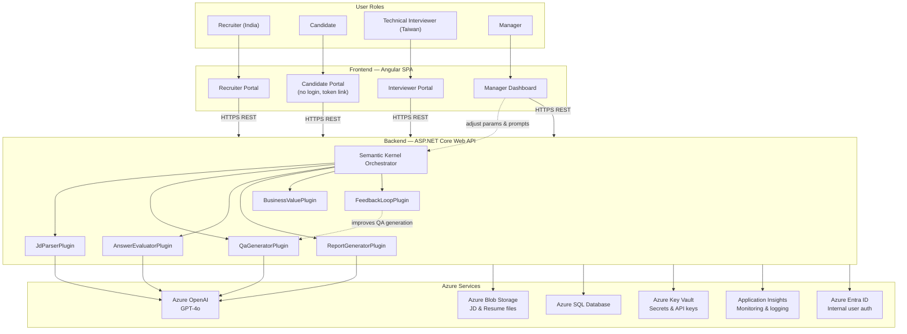

# 06 — 系統架構與 Azure 部署

## 系統架構圖



---

## Azure 服務清單

| 服務 | 用途 | 建議 SKU（初期） |
|---|---|---|
| **Azure Static Web Apps** | Angular SPA 前端 Hosting | Standard（~$9/月） |
| **Azure App Service** | ASP.NET Core Web API | B1（MVP ~$13/月）→ B2（正式 ~$75/月） |
| **Azure OpenAI** | GPT-4o 推論 | Pay-per-use |
| **Azure SQL Database** | 候選人、報告、範本、Feedback 資料 | Basic 5 DTU（~$5/月）→ 後期升級 |
| **Azure Blob Storage** | JD / Resume 檔案上傳 | LRS（~$0.02/GB/月） |
| **Azure Key Vault** | API 金鑰、連線字串加密儲存 | Standard（~$1/月） |
| **Application Insights** | 後端監控、API latency、token 用量追蹤 | Free tier（5GB/月免費） |
| **Azure Entra ID** | 內部使用者（Recruiter/Interviewer/Manager）SSO | Free tier |

> 詳細成本估算見 [07-cost-estimation.md](07-cost-estimation.md)

---

## Semantic Kernel Plugin 職責

| Plugin | 輸入 | 輸出 |
|---|---|---|
| `JdParserPlugin` | JD 文字 / 檔案 | 技術要求結構化清單、JD 向量 |
| `QaGeneratorPlugin` | JD 分析結果 + Resume（選填）+ Prompt 版本 | 英文問卷題目清單 |
| `AnswerEvaluatorPlugin` | 候選人回答 + JD 要求 + Rubric | 各題分數、Red Flags、信心分數 |
| `ReportGeneratorPlugin` | 評估結果 + Resume + JD | Stage 1 / Stage 2 報告（Markdown / PDF） |
| `BusinessValuePlugin` | 當月統計數據 + Recruiter 時薪設定 | 效率與品質指標 |
| `FeedbackLoopPlugin` | 客戶 Feedback 歷史 + 當前 Prompt 版本 | 改善建議、新 Prompt 草稿 |

---

## 資料庫綱要（草案）

```sql
-- 核心表
JobDescriptions      (id, recruiter_id, title, raw_text, parsed_json, prompt_version, created_at)
Candidates           (id, name, email, resume_blob_url, workspace_id, created_at)
Questionnaires       (id, jd_id, template_version, questions_json, created_at)
CandidateSubmissions (id, candidate_id, questionnaire_id, answers_json, submitted_at)
EvaluationReports    (id, submission_id, stage, ai_score, recommendation, report_json, created_at)
InterviewGuides      (id, submission_id, guide_json, created_at)

-- 管理表
ClientFeedback       (id, candidate_id, jd_id, recruiter_id, outcome, tags, comments, created_at)
PromptVersions       (id, plugin_name, version, prompt_text, is_active, created_at)
SystemParameters     (key, value, updated_by, updated_at)
Recruiters           (id, name, email, workspace_id, role, created_at)
```

---

## 安全性設計

| 面向 | 做法 |
|---|---|
| **身份驗證** | 內部用戶使用 Azure Entra ID SSO；候選人使用短效 Token-link（無帳號）|
| **機密管理** | 所有 API Key 及連線字串存於 Azure Key Vault，不寫入程式碼或環境變數 |
| **資料隔離** | 每個 Recruiter 資料以 `workspace_id` 隔離，Repository 層強制過濾 |
| **檔案上傳安全** | 驗證副檔名與 MIME type，設定最大檔案大小，後端掃描惡意內容 |
| **HTTPS Only** | 所有 API 通訊強制 HTTPS，HSTS 啟用 |
| **PII 保護** | Application Insights 不記錄候選人姓名、Email 等個人識別資訊 |
| **授權** | 所有 API Endpoint 加上 `[Authorize]`，候選人提交 Endpoint 使用 Token 驗證 |
