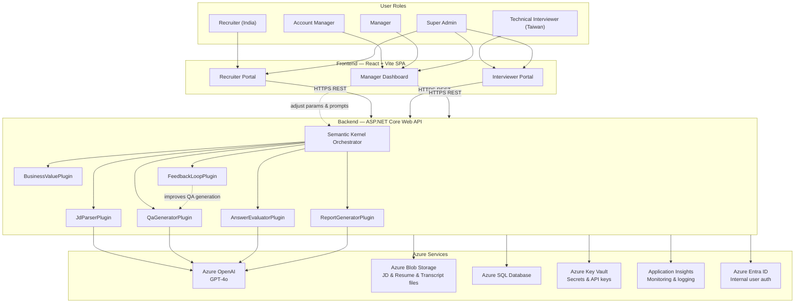

# 06 — System Architecture & Azure Deployment

## System Architecture Diagram



---

## Azure Services List

| Service | Purpose | Recommended SKU (Initial) |
|---|---|---|
| **Azure Static Web Apps** | React + Vite SPA frontend hosting | Standard (~$9/month) |
| **Azure App Service** | ASP.NET Core Web API | B1 (MVP ~$13/month) → B2 (Production ~$75/month) |
| **Azure OpenAI** | GPT-4o inference | Pay-per-use |
| **Azure SQL Database** | Candidate, report, template, feedback data | Basic 5 DTU (~$5/month) → upgrade later |
| **Azure Blob Storage** | JD / Resume file uploads | LRS (~$0.02/GB/month) |
| **Azure Key Vault** | API keys and connection strings encrypted storage | Standard (~$1/month) |
| **Application Insights** | Backend monitoring, API latency, token usage tracking | Free tier (5GB/month free) |
| **Azure Entra ID** | Internal user SSO (Recruiter/Interviewer/Manager/Account Manager) | Free tier |

> For detailed cost estimates, see [07-cost-estimation.md](07-cost-estimation.md)

---

## Semantic Kernel Plugin Responsibilities

| Plugin | Input | Output |
|---|---|---|
| `JdParserPlugin` | JD text / file | Structured tech requirements list, JD vector |
| `QaGeneratorPlugin` | JD analysis result + Resume (optional) + Prompt version | English questionnaire question list |
| `AnswerEvaluatorPlugin` | Candidate answers + JD requirements + Rubric | Per-question scores, Red Flags, confidence score |
| `ReportGeneratorPlugin` | Evaluation results + Resume + JD | Stage 1 / Stage 2 reports (Markdown / PDF) |
| `BusinessValuePlugin` | Monthly statistics + Recruiter hourly rate setting | Efficiency and quality metrics |
| `FeedbackLoopPlugin` | Client feedback history + current Prompt version | Improvement suggestions, new Prompt drafts |

---

## Database Schema (Draft)

```sql
-- Core Tables
JobDescriptions      (id, recruiter_id, title, raw_text, parsed_json, prompt_version, created_at)
Candidates           (id, name, email, resume_blob_url, workspace_id, created_at)
Questionnaires       (id, jd_id, template_version, questions_json, created_at)
CandidateAnswers     (id, candidate_id, questionnaire_id, answers_json, submitted_at, submitted_by_recruiter_id)
EvaluationReports    (id, candidate_answer_id, stage, ai_score, recommendation, report_json, created_at)
InterviewGuides      (id, candidate_answer_id, guide_json, created_at)
InterviewTranscripts (id, candidate_id, transcript_blob_url, uploaded_by, created_at)

-- Management Tables
ClientFeedback       (id, candidate_id, jd_id, submitted_by, outcome, tags, comments, created_at)
PromptVersions       (id, plugin_name, version, prompt_text, is_active, created_at)
SystemParameters     (key, value, updated_by, updated_at)
Users                (id, name, email, workspace_id, role, created_at)
```

---

## Security Design

| Aspect | Approach |
|---|---|
| **Authentication** | All internal users (Recruiter / Interviewer / Manager / Account Manager / Super Admin) use Azure Entra ID SSO; candidates do not access this system |
| **Secret Management** | All API keys and connection strings stored in Azure Key Vault; never written to code or environment variables |
| **Data Isolation** | Each Recruiter's data is isolated by `workspace_id`, enforced at the Repository layer; Super Admin is not restricted |
| **File Upload Security** | Validate file extension and MIME type, set maximum file size, backend scans for malicious content |
| **HTTPS Only** | All API communication enforced over HTTPS, HSTS enabled |
| **PII Protection** | Application Insights does not log candidate names, emails, or other personally identifiable information |
| **Authorization** | All API endpoints use `[Authorize]` with role-based access control to differentiate feature scopes |
