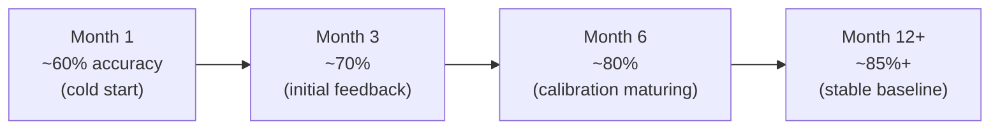

# 08 — 業務價值衡量（Business Value Dashboard）

## 衡量原則

以**時間成本節省**為主要量化依據。系統無法取得財務媒合收入數字，因此效益以 Recruiter 工時節省為核心指標。

---

## 效率指標：時間成本節省

### 基礎假設（由 Manager 輸入，可在系統參數中調整）

| 參數 | 預設值 | 說明 |
|---|---|---|
| 傳統人工初篩每人耗時 | 30 分鐘 | 審閱履歷 + 電話初篩 |
| 使用系統後每人耗時 | 8 分鐘 | 審閱 AI 報告 + 確認決策 |
| Recruiter 時薪 | Manager 輸入 | 用於折算金額估算 |
| 月候選人數 | 由系統統計 | 自動帶入 |

### 計算公式

```
每月節省工時 = (30 min − 8 min) × 本月篩選候選人數
            = 22 min × 候選人數

每月節省金額（估算）= 每月節省工時 × Recruiter 時薪
```

**範例**：100 人/月、時薪 $X → **節省 36.7 小時 × $X**

---

## 品質指標

| Metric | 說明 | 計算方式 |
|---|---|---|
| **AI 推薦準確率** | AI 推薦通過 → 最終客戶錄用的比率 | 客戶錄用數 ÷ Stage 1 AI Pass 數 |
| **Recruiter 覆核一致率** | Recruiter 接受 AI Pass/Reject 建議不修改的比率 | — |
| **客戶滿意度趨勢** | Feedback 正評比例的月度變化 | 正評 Feedback ÷ 總 Feedback 數 |
| **误判率 False Positive** | AI 推薦通過但後來客戶拒絕的比率 | — |
| **誤判率 False Negative** | AI 推薦拒絕但 Recruiter 覆核後推進且成功錄用 | — |

---

## AI 模型準確率成長預期



> 此為預期趨勢，實際數字由系統追蹤。當準確率停滯時，觸發 Prompt 審查流程。

---

## Dashboard 呈現內容

Manager 在後台可查看：

| 視圖 | 說明 |
|---|---|
| **This Month Summary** | 本月節省工時、處理候選人數、AI 準確率 |
| **Cumulative Savings** | 系統上線以來累計節省工時（小時數） |
| **Trend Charts** | Pass rate / AI accuracy / Time-to-Stage 月度趨勢 |
| **Comparison** | 與上月 / 上季的對比 |
| **System Operating Cost** | 本月 Azure 實際費用（來自 Cost Management API） |
| **Cost per Candidate** | 本月平均每位候選人的 AI + 基礎架構分攤成本 |

---

## 資料來源整合需求

| 指標 | 資料來源 | 備註 |
|---|---|---|
| 候選人處理數量 | 系統內部 DB | 自動統計 |
| Recruiter 工時節省 | 系統公式計算 | 需 Manager 輸入時薪基準 |
| 客戶錄用結果 | Recruiter 手動登錄 Feedback | 見 [05-manager-dashboard.md](05-manager-dashboard.md) |
| Azure 費用 | Azure Cost Management API | 需申請相應 API 存取權限 |
