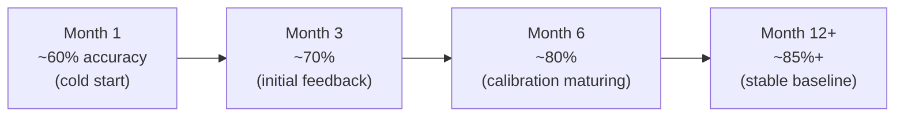

# 08 — Business Value Measurement (Business Value Dashboard)

## Measurement Principles

**Time cost savings** is the primary quantitative basis. The system cannot access financial matching revenue figures, so value is measured primarily around Recruiter time savings.

---

## Efficiency Metrics: Time Cost Savings

### Base Assumptions (input by Manager, adjustable in system parameters)

| Parameter | Default Value | Description |
|---|---|---|
| Manual initial screening time per candidate | 30 minutes | Review resume + phone screen |
| Time per candidate using the system | 8 minutes | Review AI report + confirm decision |
| Recruiter hourly rate | Manager input | Used to convert to monetary estimate |
| Monthly candidate count | Auto-populated from system | Auto-populated |

### Calculation Formula

```
Monthly Time Saved = (30 min − 8 min) × monthly candidates screened
                   = 22 min × candidate count

Monthly Savings Estimate = Monthly Time Saved × Recruiter hourly rate
```

**Example**: 100 candidates/month, hourly rate $X → **save 36.7 hours × $X**

---

## Quality Metrics

| Metric | Description | Calculation |
|---|---|---|
| **AI Recommendation Accuracy** | Ratio of AI-recommended passes → final client hire | Client hires ÷ Stage 1 AI Pass count |
| **Recruiter Review Agreement Rate** | Rate at which Recruiter accepts AI Pass/Reject without modification | — |
| **Client Satisfaction Trend** | Monthly change in positive feedback ratio | Positive Feedback ÷ Total Feedback count |
| **False Positive Rate** | Rate of AI-recommended passes that client later rejects | — |
| **False Negative Rate** | Rate of AI-recommended rejects that Recruiter overrides and proceeds to successful hire | — |

---

## AI Model Accuracy Growth Projection



> This is a projected trend; actual numbers are tracked by the system. When accuracy plateaus, trigger a Prompt review process.

---

## Dashboard Content

Manager can view in the backend:

| View | Description |
|---|---|
| **This Month Summary** | Monthly time saved, candidates processed, AI accuracy |
| **Cumulative Savings** | Total time saved since system launch (in hours) |
| **Trend Charts** | Monthly trends of pass rate / AI accuracy / Time-to-Stage |
| **Comparison** | Comparison with prior month / prior quarter |
| **System Operating Cost** | Actual Azure cost for this month (from Cost Management API) |
| **Cost per Candidate** | Average AI + infrastructure cost allocated per candidate this month |

---

## Data Source Integration Requirements

| Metric | Data Source | Notes |
|---|---|---|
| Candidate processing count | Internal system DB | Auto-calculated |
| Recruiter time savings | System formula calculation | Requires Manager to input hourly rate baseline |
| Client hire results | Manual feedback logged by Recruiter | See [05-manager-dashboard.md](05-manager-dashboard.md) |
| Azure costs | Azure Cost Management API | Requires appropriate API access permissions |
