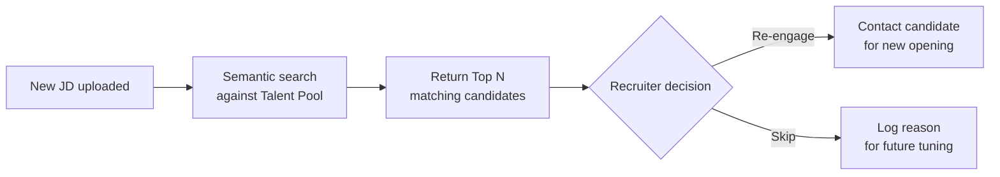

# 09 — Talent Pool Design

## Design Goals

The Talent Pool transforms this system into a long-term **engineering candidate data asset**, providing the company with a compounding competitive advantage:

> Competitors can copy the recruitment process, but cannot copy years of accumulated talent pool data.

---

## Data Sources

Every candidate who enters the system, regardless of whether they are ultimately hired, has their evaluation data retained as a long-term record:

| Data Type | Description |
|---|---|
| Basic Info | Name, contact information, tech stack tags |
| Evaluation Records | Stage 1 & Stage 2 reports (if applicable) |
| JD Fit Records | JD vs. evaluation score for each application |
| Hire Outcome | Whether successfully matched, client feedback |
| Growth Trajectory | If the same candidate applies multiple times, cross-application comparison of technical evaluation differences |

---

## Core Features

### Search & Filter

| Search Criteria | Description |
|---|---|
| Tech stack keywords | Angular / .NET / Azure / React, etc. |
| Past evaluation scores | Stage 1 AI score ≥ N |
| Semantic search (JD matching) | Upload a new JD to find the best-matching candidates in the talent pool |
| Pass / hire status | Filter for candidates previously hired by clients |
| Last active time | Avoid contacting records that are too outdated |

### Re-engagement Mechanism

When a new JD is uploaded:

### Premium Talent Pool (Optional)

With client authorization, candidates who "passed a particular client's interview" can be tagged as Premium Pool and prioritized for recommendation to other clients with similar requirements.

---

## Data Retention Policy

> **⚠ Policy not yet finalized (see [11-open-decisions.md](11-open-decisions.md))**

Items to confirm:

- Candidate data retention period (e.g. 2 years? 5 years? Indefinite?)
- Auto-archive / anonymization process after inactivity
- Process for handling candidate requests to delete personal data (GDPR / personal data law compliance)
- Regional regulatory differences (Taiwan Personal Data Protection Act vs. India PDPB)

---

## Future Expansion Ideas

| Feature | Description |
|---|---|
| **Technology trend analysis** | Talent density for certain tech stacks in the pool over time, providing market insights |
| **Salary expectation tracking** | Distribution of salary expectations across different tech stacks |
| **Demand gap detection** | Identify which JD types have low talent pool coverage, suggest proactive sourcing |
| **Candidate growth tracking** | Technical growth trajectory for candidates who apply multiple times, for future priority evaluation |
