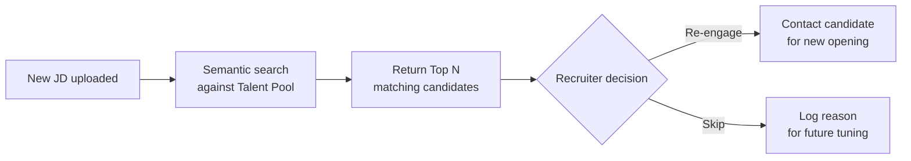

# 09 — 人才庫規劃（Talent Pool）

## 設計目標

人才庫將本系統轉化為長期的**工程師資料資產**，為公司帶來可複利的競爭優勢：

> 同業可以複製招募流程，但無法複製已沉澱多年的人才庫資料。

---

## 資料來源

每位進入系統的候選人，無論最終是否錄用，其評估資料均保存為長期記錄：

| 資料類型 | 說明 |
|---|---|
| 基本資料 | 姓名、聯絡方式、技術棧標籤 |
| 評估記錄 | Stage 1 & Stage 2 報告（若有） |
| JD 符合度記錄 | 每次應徵的 JD vs. 評估分數 |
| 錄用結果 | 是否成功媒合、客戶 Feedback |
| 成長軌跡 | 若同一候選人多次應徵，跨次比較技術評估差異 |

---

## 核心功能

### 搜尋與篩選

| 搜尋條件 | 說明 |
|---|---|
| 技術棧關鍵字 | Angular / .NET / Azure / React 等 |
| 過去評估分數 | Stage 1 AI 分數 ≥ N |
| 語意搜尋（JD 比對） | 上傳新 JD，找出人才庫中最符合的候選人 |
| 通過 / 錄用狀態 | 篩選曾被客戶錄用的優質候選人 |
| 最後活躍時間 | 避免聯繫過於久遠的記錄 |

### 再接觸機制

當有新 JD 時：

### Premium Talent Pool（選配）

若客戶授權，可將「曾通過某客戶面試的優質人才」標記為 Premium Pool，優先推薦給其他有相似需求的客戶。

---

## 資料保留政策

> **⚠ 政策尚未確定（見 [11-open-decisions.md](11-open-decisions.md)）**

需確認的項目：

- 候選人資料保留年限（例如 2 年？5 年？無限期？）
- 無活動後的自動歸檔 / 匿名化流程
- 候選人要求刪除個人資料的處理流程（GDPR / 個資法合規）
- 跨地區法規差異（台灣個資法 vs. 印度 PDPB）

---

## 未來擴展構想

| 功能 | 說明 |
|---|---|
| **技術趨勢分析** | 人才庫中某技術棧的人才密度隨時間變化，提供市場洞察 |
| **薪資期望追蹤** | 不同技術棧人才的薪資期望分佈 |
| **需求缺口偵測** | 哪類 JD 目前人才庫覆蓋率低，建議主動招募 |
| **候選人成長追蹤** | 多次應徵的候選人技術成長軌跡，供未來優先評估 |
